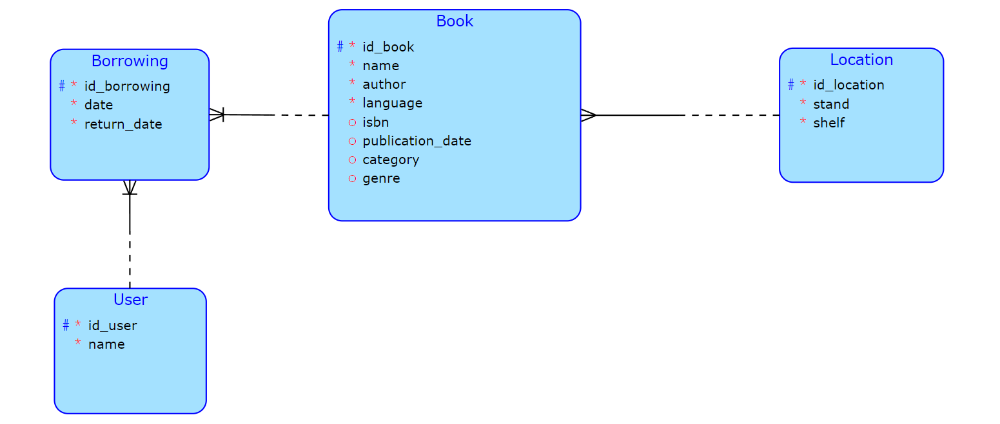

# Databáze knihovny - server

Práce bude zprostředkovávat správu domácí knihovny. Bude evidovat vlastněné knihy a jejich umístění v knihovně. Dále bude ukládat záznamy o výpůjčkách a kontrolovat dostupnost knih. 
### Relační schéma:
 

 

- každá kniha má vlastní **ID** pro identifikaci, **jméno knihy**, **jméno autora** a **jazyk**, ve kterém je napsána (nejčastěji čeština/angličtina). Její nepovinné atributy jsou **ISBN**, **datum vydání**, **kategorie**, která se rozděluje pouze na světovou a českou (přání klienta), a **literární žánr** (pravděpodobně bude zjednodušen hlavně na beletrii a poezii).
- knihy jsou v knihovně uloženy na konkrétním místě. Tuto skutečnost představuje entita lokace, která kromě svého ID ukládá pouze sloup a polici