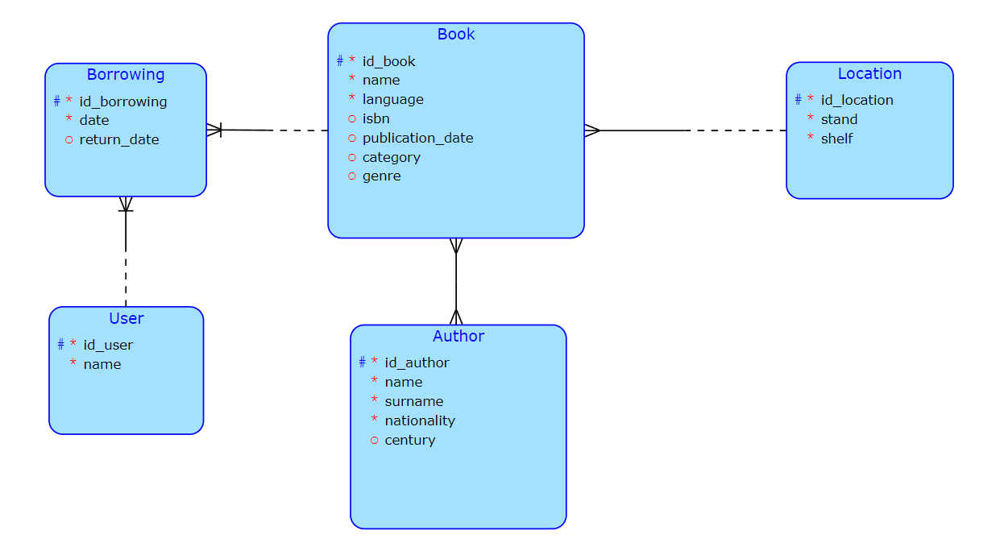

# Databáze knihovny - server

Práce bude zprostředkovávat správu domácí knihovny. Bude evidovat vlastněné knihy a jejich umístění v knihovně. Dále bude ukládat záznamy o výpůjčkách a kontrolovat dostupnost knih. 
### Relační schéma:
 

 

- každá kniha má vlastní **ID** pro identifikaci, **jméno knihy** a **jazyk**, ve kterém je napsána (nejčastěji čeština/angličtina). Její nepovinné atributy jsou **ISBN**, **datum vydání**, **kategorie**, která se rozděluje pouze na světovou a českou (přání klienta), a **literární žánr** (pravděpodobně bude zjednodušen hlavně na beletrii a poezii).
- pro evidování knih je velmi podstatné evidovat i jejího autora. Kniha má vždy jednoho nebo více autorů a autor mohl napsat jednu nebo více knih. Program u něj eviduje jeho **ID**, **jméno**, **příjmení** a **národnost**. Dobrovolný atribut je ještě **století**, ve kterém autor nejvíce vydával (může se hodit pro vyhledávání knih).
- knihy jsou v knihovně uloženy na konkrétním místě. Tuto skutečnost představuje entita lokace, která kromě svého **ID** ukládá pouze **sloup** a **polici**. Více knih může být na jednom místě (na poličku se vejde asi 20 knih).
- další entitou je uživatel. U něj je evidováno pouze **ID** a **jméno**. Každý uživatel si může půjčit knihu, výpůjček může provést několik, ale evidují se vždy po jedné.
- entita výpůjčka je pouze dekomponovaná vazba M:N mezi uživatelem a knihou, kde jsou přidány parametry **data půjčení** a **data vrácení**, datum vrácení je nepovinný parametr (přidá se až určitou dobu po vzniku záznamu). Jedná se o slabou entitu.

### Business operace:
Hlavní funkce celého programu bude evidence knih, takže bude muset umět ukládat nové knihy a mazat vyřazené. Stejně tak bude umět odebírat a přidávat nové umístění a aktualizovat veškeré informace. 
Druhá větší funkcionalita bude půjčování knih. Při půjčení knihy bude muset program vytvořit nového uživatele nebo najít stávajícího a přidat k němu další výpůjčku. Zároveň bude muset najít žádanou knihu a zkontrolovat, zda je dostupná (nemá ji zrovna půjčenou někdo jiný). Jakmile proběhnou tyto kontroly, tak program vytvoří nový záznam s datem, kdy byla kniha zapůjčena. Ve chvíli kdy uživatel knihu vrátí, tak k výpůjčce přidá datum vrácení, tím se kniha stane opět dostupnou. 
V programu bude možné vznést dotaz na vypsání všech současně zapůjčených knížek spolu s uživateli, kteří si knihu zapůjčili. 
Knihy bude možné vyhledávat i podle autorů, národnosti autorů a v případě uvedení i podle období, ve kterém autoři vydávali. 
